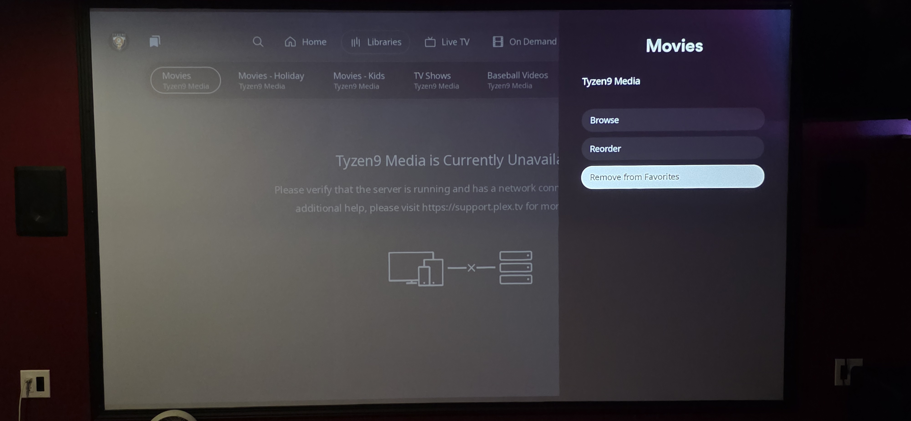

# New PLEX User Interface (UI) on Roku
### September 17, 2025

This week Plex rolled out its new User Interface (UI) on Roku.  And of course they "[moved our cheese](https://en.wikipedia.org/wiki/Who_Moved_My_Cheese%3F)" and people are really upset.  The first thing you may notice is that the main menu is now at the top. With this, the new `libraries` menu is different and some people are seeing "Unavailable" messages like this:

1. To solve this click the `...` (3 dots) all the way to the right and you should see a list of your Plex libraries, something like this:

2. Click the heart next to `Movies` and press the `<--` (back) button on the remote and now you should at least see `Movies` in the list all the way to the right as shown here:

3. At this point, we have proven that we can get the `Movies` link back under the new Libraries section of the Roku UI. Now, lets get rid of all the bogus links that you do not need. Highlight the first link showing that the media is "Unavailable". In the image below I chose the first `Movies` link.

4. Now press the `*` (star) key on your remote, and choose `Remove from Favorites` as shown below:

5. Repeat this until all the bogus library links are removed. In my case, as show below, I was left with the one `Movies` link we added at the begining of this process in step #2.

6. Now click the `...` (3 dots) to the right of `Movies`, and put a heart next to all the libraries you want to appear on the main screen.  When all have been selected/hearted, click the `<--` (back) button on the remote.

7. At this point all the non-functional libraries that came from "I don't know land", have been removed and you can feel better about your new Plex experience on Roku.  

Enjoy...